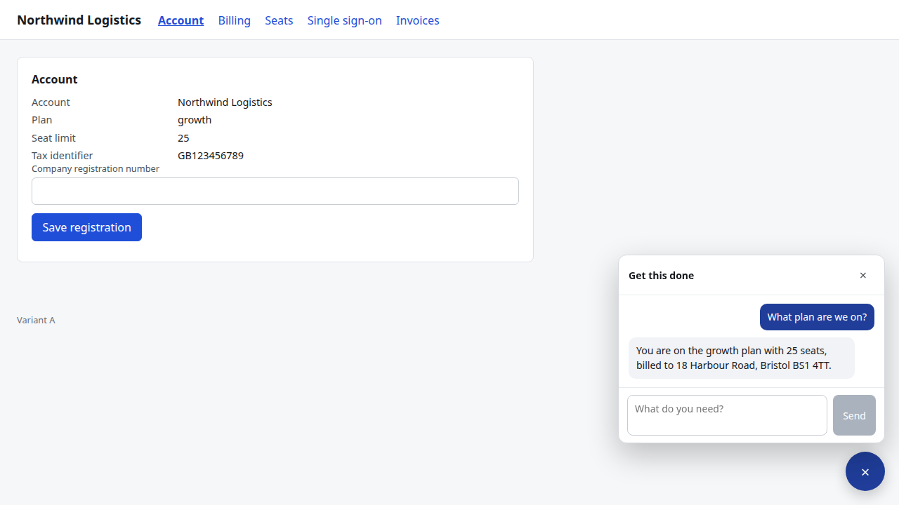

# SuperGuide

An in-app resolution agent for B2B SaaS products. It is embedded by a script tag, and when an
end user is stuck it finishes the task rather than explaining it: calling the customer's API,
invoking capabilities the customer registered, navigating their product, and reporting
honestly when it cannot.

Two properties are load-bearing throughout.

**Every action carries a machine-checkable success criterion.** Nothing is reported as done
until a predicate has been evaluated against real state. When a predicate fails, the person
and the support team are told. Silent failure is treated as a defect, not a rough edge.

**Behaviour is a structured artifact the customer owns.** Procedures, policies, and scopes are
versioned, validated files a support lead can author. They are never a free-text instructions
box, and the model never decides what it is permitted to do.

## The execution ladder

Every task attempts these in order. Deterministic mechanisms come first; perception is the
fallback, never the default.

| Level | Mechanism | State |
|---|---|---|
| L1 | API call compiled from the tenant's OpenAPI document | Shipped |
| L2 | Declared client capability, a typed handler the customer registered | Shipped |
| L3 | Route navigation from the product's route registry | Shipped |
| L4 | Grounded interface action over the accessibility digest | Built, off unless `SG_ENABLE_GROUNDED_ACTIONS` and the product both allow it |
| L5 | Ask the person one precise question | Shipped |
| L6 | Escalate to a person with the complete trajectory | Shipped |

Perception is the accessibility digest only. There is no screenshot capture anywhere in this
repository.

## Layout

```
apps/control-plane   Fastify server, agent runtime, migrations, console
apps/widget          the IIFE bundle and the boot contract
apps/console         the support-lead surface
apps/fixture-app     a test-target SaaS with a real API, an OpenAPI document, and two interface variants
packages/contract    Zod schemas for every wire and storage shape, split public and internal
packages/policy      the pure verdict function (widget + extension)
packages/adapters    site adapters for the extension surface
packages/procedures  the procedure schema, loader, and matcher
packages/observer    DOM to page digest, read only
packages/executor    the closed action vocabulary
packages/client-core transport, stream, durability, dispatch
packages/widget-ui   the chat surface, in a closed shadow root
eval/                thirty task fixtures and the harness that scores them
```

One process serves two clients. The widget uses `/v1`. The Chrome extension (SuperGuide-Anywhere repo) uses `/v1/anywhere`. Step-by-step local setup: `LOCAL_TESTING.md`.

## Seeing it work

```
pnpm install && pnpm build
pnpm db:start          # or: docker compose up -d
pnpm demo
```

That prints a URL. Open it in any browser and the widget is on the page.



`INTEGRATION.md` covers putting it on a real product: origin allowlist, OpenAPI ingestion,
identity, capabilities, procedures, escalation, and what a customer's Content-Security-Policy
needs.

## Running it

```
pnpm install
pnpm env:init                 # writes .env, generating the keys
pnpm build

docker compose up -d          # PostgreSQL 16 with pgvector
pnpm db:migrate

pnpm --filter @superguide/fixture-app run dev
pnpm --filter @superguide/control-plane run dev
```

Run `pnpm env:init` first. It writes `.env` from `.env.example` and generates the signing
and encryption keys, leaving the model provider key for you to fill in. If the file
already exists, the command exits without overwriting it — that is expected. Every
variable is validated by a Zod schema at process start and the process exits non-zero if
the environment is wrong.

### Model providers

`SG_MODEL_PROVIDER` selects who serves the planner and the classifiers; only the selected
provider's key must be set:

| Provider | Key variable | Planner | Classifier |
|---|---|---|---|
| `anthropic` (default) | `ANTHROPIC_API_KEY` | `claude-opus-5` | `claude-haiku-4-5` |
| `openai` | `OPENAI_API_KEY` | `gpt-5.5` | `gpt-5.4-mini` |
| `gemini` | `GEMINI_API_KEY` | `gemini-2.5-pro` | `gemini-2.5-flash` |

The turn loop, tool compilation, and journal all speak one internal message shape; each
provider is a `ModelClient` that translates at the edge
(`apps/control-plane/src/model/`). The routing table's model ids name roles — planner or
classifier — and each client maps them to its own vendor's models, so effort escalation
and the recovery path work identically everywhere. Reasoning state a vendor requires back
on later turns (encrypted reasoning items, thought signatures) rides the turn history, so
a conversation is served end to end by the provider that started it. Switching is one
`.env` line plus the matching key — no rebuild.

No key value is committed anywhere in this repository, and none should be: `.env.example`
ships those three fields blank, and CI generates its own per run. The fixed
`Buffer.alloc(32, n)` keys in the test and eval harnesses are the exception that proves it —
they are constants in code rather than committed secrets, and they are fixed because
`pnpm eval --check-determinism` requires two runs to reproduce byte for byte.

Without Docker, `pnpm db:start` runs the same PostgreSQL 16 from a local install
(`SG_PG_HOME`, default `~/.local/superguide-pg16`) on the same port, with the same two roles.

## Verifying it

```
pnpm lint                    # boundaries, purity, banned vendor names
pnpm typecheck
pnpm test:unit               # policy at 100% branch coverage, digest, executor, redaction
pnpm test:integration        # against a real PostgreSQL
pnpm test:security           # every row of the security matrix
pnpm test:e2e                # the real widget in a real browser
pnpm eval --variant=a        # thirty tasks against interface variant A
pnpm eval --variant=b        # the same thirty against the redesign
pnpm check:forbidden
pnpm check:bundle-boundary
```

`pnpm eval --variant=a --check-determinism` runs the suite twice and fails if any task did not
reproduce exactly.

## Two roles, and why

The application connects as `sg_app`, which owns no table and has no `BYPASSRLS`. Every
tenant-scoped table has row-level security forced on, keyed on `product_id` through
`sg_current_product_id()`, which returns NULL when the scope is unset or has been reset on a
pooled connection. A connection that forgets to scope itself therefore sees nothing rather than
everything, and there is a test that asserts exactly that.

`sg_migrator` owns the schema, runs migrations, and holds the administrative policies. It is
never what the application connects as.

## Identity

Asymmetric only. The customer signs; SuperGuide holds a public key or fetches their JWKS. The
permitted algorithms come from the product's configuration rather than from the token header,
so a token signed with a symmetric key derived from the public key is refused before any
signature is checked. There is no code path anywhere in this repository that mints a token for
a customer's user, and no symmetric key with which one could.
